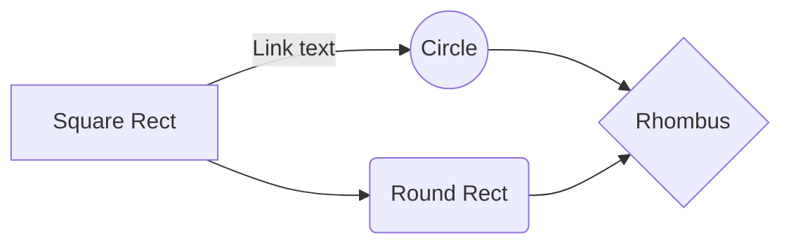

**Table of Contents**
<!-- markup:toc /-->
<!-- markup:output -->
- [Introduction](#introduction)
- [Syntax](#syntax)
  - [Block Tag](#block-tag)
  - [Fence Tag](#fence-tag)
- [Built In Directives](#built-in-directives)
  - [drawio](#drawio)
  - [file](#file)
  - [ignore](#ignore)
  - [output](#output)
  - [process](#process)
  - [template](#template)
  - [toc](#toc)
- [Markup Configuration](#markup-configuration)
- [Plugins](#plugins)
<!-- /markup:output -->

---

## Introduction

Markup is a package to provide automated processing for Markdown files to be able to simplify the creation and maintenance of documentation.

---

## Syntax

Like most markdown processors, markup uses comments to annotate the processing that neds to occur. The syntax allows for single tag directives as well as block based directives. However, each directive supports only one of the syntaxes and which one is documented in the directive itself.

All directives take the general form of `<!-- markup:directive`. The difference in what follows is defined by whether it is a single tag format or a block format.

---

### Single Tag

Single tags are contained within a single comment itself and the contents of the tag are hidden from the rendered markdown. With the single tag format, the tag must end with `/-->`. This informs the parser that the tag has ended. Single tag formats allow for parameters to follow the directive in either JSON or YAML form. Let's take the example parameters:

```json
{ "file": "my.drawio", "type": "svg" }
```

That can be added in any of the following ways:
<!-- markup:ignore -->

```markdown
<!-- markdown:name {"file": "my.drawio", "type": "svg"} /-->

<!-- markdown:name
{
  "file": "my.drawio",
  "type": "svg"
}
/-->

<!-- markdown:name
file: my.drawio
type: svg
/-->
```

<!-- /markup:ignore -->

---

### Block Tag

The block tags start and end with markup comment. The content within the tags is visible via the rendered Markdown file. An example of a block tag is:
<!-- markup:ignore -->

```markdown
<!-- markup:output -->


<!-- /markup:output -->
```

<!-- /markup:ignore -->

---

### Fence Tag

The fence tags utilize the standard GitHub fence syntax. This mechanism is provided for plugins as no built in processors exist for the fence syntax. For an example, see the [markup_mermaid](https://pub.dev/packages/markup_mermaid) plugin.

````markdown

````

---

## Built In Directives

| Directive  | Type     | Description                                                                          |
| ---------- | -------- | ------------------------------------------------------------------------------------ |
| `drawio`   | `single` | Exports a single image from a DrawIO file and then links to the image in the output. |
| `file`     | `single` | Embeds the contents of a single file into the output.                                |
| `ignore`   | `block`  | Disables markup processing for everything within the block.                          |
| `output`   | `block`  | The contents of the block are outputs from other markup directives.                  |
| `process`  | `single` | Executes a process and places the `stdio` from the process into the output.          |
| `template` | `single` | Processes a [template_expression] and places the results into the output.            |
| `toc`      | `single` | Generates a Table of Contents for the document and places it into the output.        |

---

### `drawio`

**Example**

[drawio.md](https://raw.githubusercontent.com/islandlifetechnologies/markup/refs/heads/main/packages/markup/test/assets/drawio.md)

**Parameters**

| Name    | Type             |      Template      | Description                                                                             |
| ------- | ---------------- | :----------------: | --------------------------------------------------------------------------------------- |
| `file`  | `String`         | :white_check_mark: | The path, relative to the Markdown file, of the DrawIO file to generate the image from. |
| `label` | `String?`        |        :x:         | The label to use within the generated Markdown to link to the generated image.          |
| `index` | `int = 1`        |        :x:         | The tab index of the tab to export from DrawIO.                                         |
| `mode`  | `String = 'svg'` |        :x:         | Either `png` or `svg`. Defiles the file type to export.                                 |
| `width` | `int?`           |        :x:         | Only applies when exporting a `png`. Defines the width to use for the exported image.   |

---

### `file`

**Example**

[file.md](https://raw.githubusercontent.com/islandlifetechnologies/markup/refs/heads/main/packages/markup/test/assets/file.md)

**Parameters**

| Name   | Type     |      Template      | Description                                                    |
| ------ | -------- | :----------------: | -------------------------------------------------------------- |
| `file` | `String` | :white_check_mark: | The path, relative to the Markdown file, of the file to embed. |

---

### `ignore`

**Example**

[full_processing.md](https://raw.githubusercontent.com/islandlifetechnologies/markup/refs/heads/main/packages/markup/test/assets/full_processing.md)

**Parameters**

_n/a_

---

### `output`

**Example**

_n/a_

**Parameters**

_n/a_

---

### `process`

**Example**

[process.md](https://raw.githubusercontent.com/islandlifetechnologies/markup/refs/heads/main/packages/markup/test/assets/process.md)

**Parameters**

| Name                | Type           |      Template      | Description                                                                      |
| ------------------- | -------------- | :----------------: | -------------------------------------------------------------------------------- |
| `args`              | `List<String>` |        :x:         | The optional arguments to pass to the command.                                   |
| `command`           | `String`       |        :x:         | The command to execute.                                                          |
| `ignore-exit-code`  | `bool = false` |        :x:         | When `true`, ignores non-zero exit codes and uses whatever `stdout` was emitted. |
| `working-directory` | `String = '.'` | :white_check_mark: | The working directory to run the command from.                                   |

---

### `template`

**Example**

[template.md](https://raw.githubusercontent.com/islandlifetechnologies/markup/refs/heads/main/packages/markup/test/assets/template.md)

**Parameters**

| Name       | Type                    |      Template      | Description                                                                                  |
| ---------- | ----------------------- | :----------------: | -------------------------------------------------------------------------------------------- |
| `context`  | `Map<String, dynamic>?` |        :x:         | Optional context to pass to the template engine for when processing the `file` or `template` |
| `file`     | `String?`               | :white_check_mark: | The file containing the template to process. Either this or `template` is required.          |
| `syntax`   | `String`                |        :x:         | The [Template Syntax] to use when processing the template.                                   |
| `template` | `String?`               | :white_check_mark: | The template to process. Either this or `file` is required.                                  |

---

### `toc`

**Example**

[toc.md](https://raw.githubusercontent.com/islandlifetechnologies/markup/refs/heads/main/packages/markup/test/assets/toc.md)

**Parameters**

| Name     | Type           | Template | Description                                |
| -------- | -------------- | :------: | ------------------------------------------ |
| `bullet` | `String = '-'` |   :x:    | Character to use for the bullet rendering. |

---

## Markup Configuration

Markup can be configured via CLI Args or via a configuration file that may be in either JSON or YAML. Any value specified as a CLI arg will take priority over the same value in the configuration file. If a `markup.yaml` file exists, Markup will utilize that file by default as the configuration file.

[Plugins](#plugins) can only be added via the configuration file, they cannot be passed in via the CLI.

**CLI Args**
<!-- markup:process

command: dart
args:
  - bin/markup.dart
  - --help
output:
  fence: "```"

/-->
<!-- markup:output -->
```
markup 1.0.0

-c, --config     Configuration file for markup to use.
-i, --include    The search glob to find the file or files to modify.
-l, --log        Log level to use.
                 [ALL, FINEST, FINER, FINE, CONFIG, INFO, WARNING, SEVERE, SHOUT, OFF]
-o, --output     If set, all results will be written to this path and it's sub paths.
    --dry-run    Perform a dry run, print all the logs, but do not write any Markdown files.
    --help       Display this message.
    --version    Display version information.
```
<!-- /markup:output -->

**Config File**

All values are shown with their defaults in place.

```yaml
# Whether to perform all processing but not actually write any output
dry-run: false

# The files for markup to scan for processing
include: "**/*.md"

# Log level to use.
# Valid values: ALL, FINEST, FINER, FINE, CONFIG, INFO, WARNING, SEVERE, SHOUT, OFF
log: INFO

# If set, all results will be written to this path and its sub paths
output: null

# The plugins to use
plugins:
  # The directive or code fence name to associate with this plugin
  <name>:
    # The command to execute (required)
    command: <command>

    # The optional arguments to pass to the command
    args: []

    # When true, ignores non-zero exit codes and uses whatever stdout was emitted
    ignore-exit-code: false

    # Defines if the processor is meant to run after the first pass of processing
    post-processor: false

    # Defines if the processor should replace the source content with the output of the process
    replace: false

    # The maximum timeout in seconds to wait for the plugin (defaults to 1 minute)
    timeout: 60
```

**Parameters**

| Name      | Type                   | Description                                                                                                                |
| --------- | ---------------------- | -------------------------------------------------------------------------------------------------------------------------- |
| `dry-run` | `bool = false`         | Perform a dry run, print all the logs, but do not write any Markdown files.                                                |
| `include` | `String = '**/*.md'`   | The search glob to find the file or files to modify.                                                                       |
| `log`     | `String = 'INFO'`      | Log level to use. Allowed values: `ALL`, `FINEST`, `FINER`, `FINE`, `CONFIG`, `INFO`, `WARNING`, `SEVERE`, `SHOUT`, `OFF`. |
| `output`  | `String?`              | If set, all results will be written to this path and its sub paths.                                                        |
| `plugins` | `Map<String, Plugin>?` | The plugins to use, keyed by the directive or code fence tag name.                                                         |

---

## Plugins

Plugins can be created to provide processing not provided by markup itself. One such example is the [markup_mermaid] plugin.

Plugins must have an executable that reads the parameters via `stdin`. Plugins need to utilize the [markup_common] package and implement the [MarkupProcessor](https://github.com/islandlifetechnologies/markup/blob/main/packages/markup_common/lib/src/processor/markup_processor.dart) interface.

Next, the plugin must be added to the [Markup Configuration] under the `plugins` map. The key in the `plugins` map determines the directive or fence tag name handled by the plugin.

**Example**

```yaml
plugins:
  mermaid:
    command: markup_mermaid
    replace: true

    # Example to enable the max logging
    args:
      - log
      - FINEST

    # Already defaults to false, included for example purposes
    ignore-exit-code: false

    # Already defaults to false, included for example purposes
    post-processor: false
```

**Parameters**

| Name               | Type                | Description                                                                                                                                                     |
| ------------------ | ------------------- | --------------------------------------------------------------------------------------------------------------------------------------------------------------- |
| `args`             | `List<String> = []` | The optional arguments to pass to the plugin command.                                                                                                           |
| `command`          | `String`            | The command to execute.                                                                                                                                         |
| `ignore-exit-code` | `bool = false`      | When `true`, ignores non-zero exit codes and uses whatever `stdout` was emitted.                                                                                |
| `post-processor`   | `bool = false`      | Defines if the processor is meant to run after the first pass of processing. This should only be `true` when the processor utilizes output of other processors. |
| `replace`          | `bool = false`      | Defines if the processor should replace the source content with the output of the process. When `false`, the output will be appended.                           |
| `timeout`          | `int = 60`          | The maximum duration in seconds to wait for the plugin to finish executing (defaults to 1 minute).                                                              |

<!-- links -->

[markup_common]: https://pub.dev/packages/markup_common
[markup_mermaid]: https://pub.dev/packages/markup_mermaid
[template_expression]: https://pub.dev/packages/template_expressions
[Markup Configuration]: #markup-configuration
[Template Syntax]: https://pub.dev/packages/template_expressions#template-expression-syntax