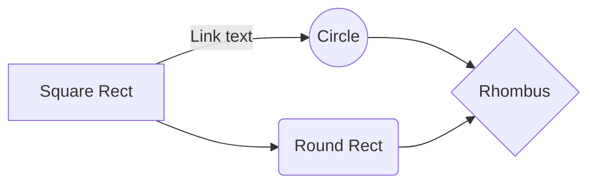

## Fence
```dart
class Foo {}
```

````markdown
And here is another example...

```dart
print('Hello')
```
````

```
No type on this one
```

- Bullet
  ```yaml
  # This is associated with the bullet
  ```


