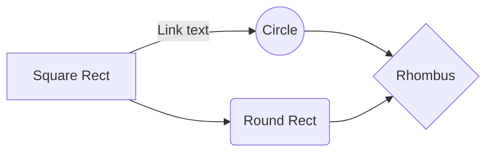
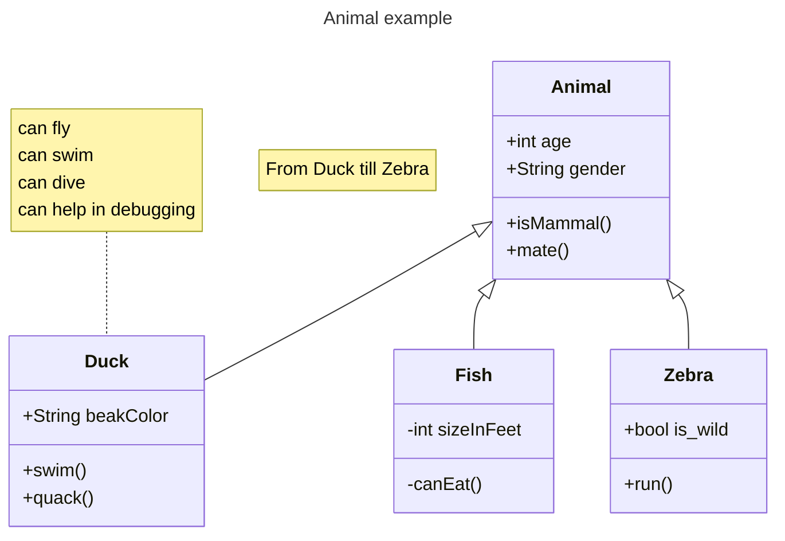
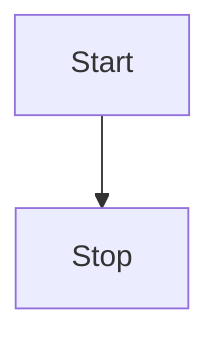

# Full Processing

## Table of Contents

<!-- markup:toc /-->

## Mermaid







---

## Code with Comment

```bash
# Say Hello
echo "Hello"
```

---

## DrawIO

<!-- markup:drawio {"file": "drawio/infographic.drawio"} /-->

---

## Fences

````
```markdown
<!-- markup:file {"file": "../../LICENSE"} /-->
```
````

<!-- markup:ignore -->

## Ignore

<!-- markup:file {"file": "../../LICENSE"} /-->
<!-- /markup:ignore -->

## Template

<!-- markup:template
template: "# Hello World"
/-->

```

```
